# **Embracing With Technology**

## Reflections

Things from the past came back to my mind, especially when we played with Arduino during the workshop wit Jazmin Morris.

I remember my oldest brothers trying to create some little robots back in 2000. I was seven and they forbid me to even look at their stuff. My brothers were interested to understand every mechanism of some of my toys; for example, I had a little toy robot mouse that could walk. They dissembled it to see how it was made; needless to say, they couldn’t reassemble it and they broke it. Here I started to hate every thing that had to do with engineering. Nevertheless, in 2000 we had one computer at home and having internet was so special, for me it was mind-blowing that on Google I could find almost everything that came up in my mind.

I grow up in a very religious family and since we had the first computer at home, the word wide web was quite a taboo, in some way I stared not keeping updated with technology ¯\\\_(ツ)_/¯.

On top of that I was (and still am) non so good in mathematics; numbers just make me want to draw/sketch on it. Nevertheless, everything about technology in some way intrigued me, but it looked so difficult and boring to understand, so for many years I left and ignored this curiosity.

**Till I met my partner ♡**

Creative computing is like a mix of me and him.

He is an Engineer, and everyday I hear talking about Maths and Physics. He is the nerd 🤓, and I’m the creative one 🤪, together we are a perfect match that have created an amazing (and functional) piece of art: <span style="color:pink">our daughter ♥︎</span>.

Thanks to this week and the introduction to creative computing of Jazmin Morris, I have no more excuses to feed this curiosity in technology and creative computing. From my own experience I now that computing and creativity can create some amazing things.

In this readme file, there will be very basic information/notes/experiments with creative computing.

#### 25/10/2021 Workshop Notes

Useful terminology:

* **STEAM**:  Science, Technology, Engineering, Arts for Mathematics.

* **HCI**: Human Computer Interaction

* **OSS**: Open-source software

  * *Open source example*: The image below is an example of open source we made in class with all students during the workshop. The task was to draw a house and each person had only 60 second to copy/edit/delete what was already designed on the paper.

<p align="center">

</p>


To style the above image I used StackOverflow ([link here](https://stackoverflow.com/questions/14675913/changing-image-size-in-markdown)) to research how to resize this image. They suggested to change the markdown syntax from

```

```
to
```

```

Then I wanted to center the image, so I followed [this other](https://stackoverflow.com/questions/12090472/how-do-i-center-an-image-in-the-readme-md-file-on-github) StackOverflow post where they simply recommended:

```
<p align="center">
  
</p>
```

* **GitHub**: Is one of the biggest open-source community. It's helpful when more than just one person is working on a project. For example, a software developer team wants to build a website and everyone has to update their codes simultaneously while working on the project.

GitHub discussion, is an dedicated space for the community to come together, ask and answer questions, and have open-ended conversations.

## Where my research led me

I decided to concentrate on the GitHub community. I wanted to create an account, upload my README.md file there and document everything. This will also be helpful for sharing my experience and learning with my classmates.

## Getting Started

* I went on [GitHub.com](https://github.com) and created an account
* I created a new repository
* GitHub automatically created a repository with a mock README.md file.
* Now that the repository exists on GitHub, I needed to clone it on my laptop. I clicked on the `Code` button, and chose _Open with GitHub Desktop_.

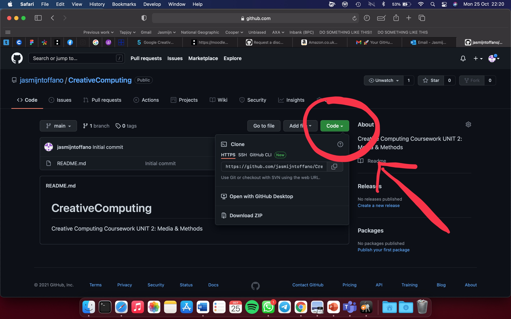

## Cloning a Repository

I chose _Open with GitHub Desktop_ because from my research I concluded that it was the easiest way. Then I followed the instructions to download the software and I logged in with my GitHub account:

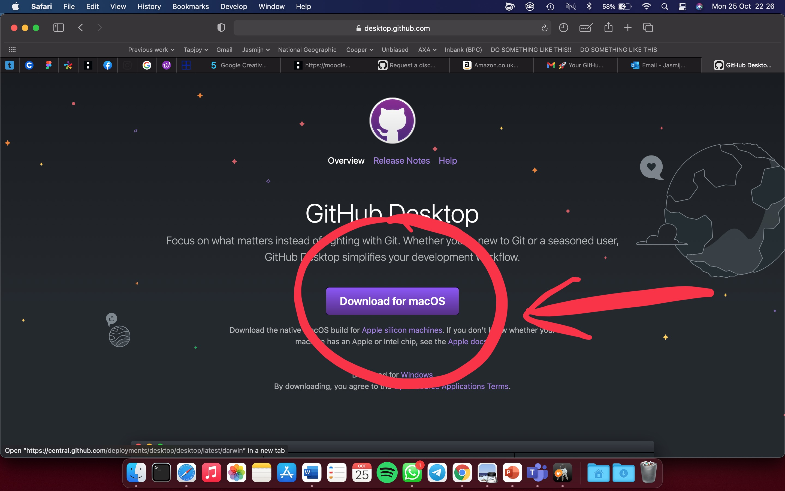

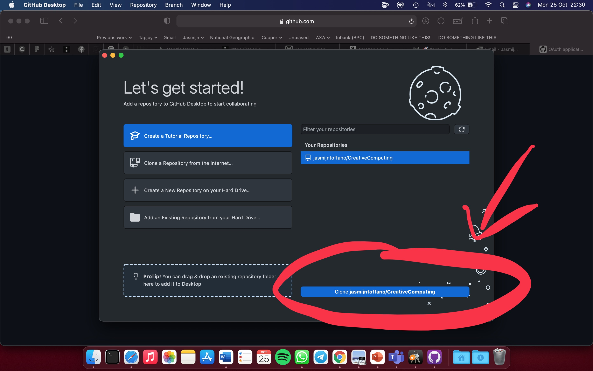

Finally I clicked on **Clone the Repository**. I chose a path on my laptop where to download the repository.


_BE AWARE: I learnt the hard way that if I move the local folder or change the name of it, GitHub Desktop can't find the folder anymore._

## Edit README.md
After researching how to open a markdown file on mac ([link of forum post here](https://apple.stackexchange.com/questions/120624/which-application-to-preview-md-files)), I decided to install [Atom](https://atom.io) because it's a free and open-source text and source code editor developed by GitHub.

Atom has an option to toggle Markdown Preview, such that while I write I can view in real time how the final markdown would look like.

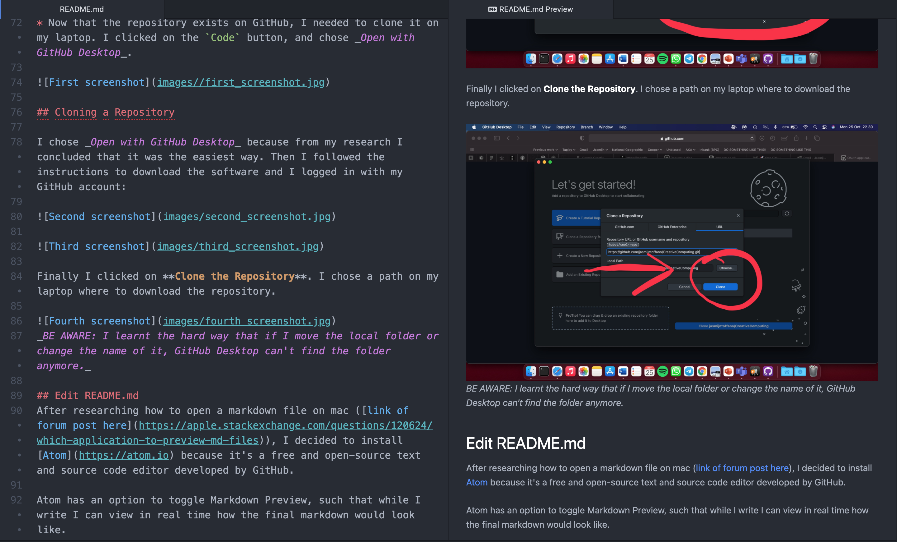

## Upload changes to GitHub

To upload my file, I would use GitHub Desktop, and there are two steps to it:
1. _Commit_: in this step I entered a small description of what the changes are.

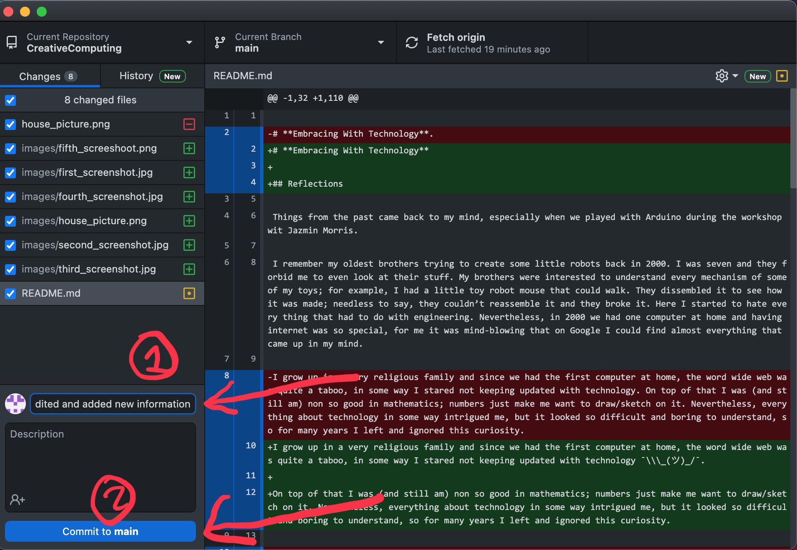

2. _Push_: this is when the file on GitHub is uploaded.

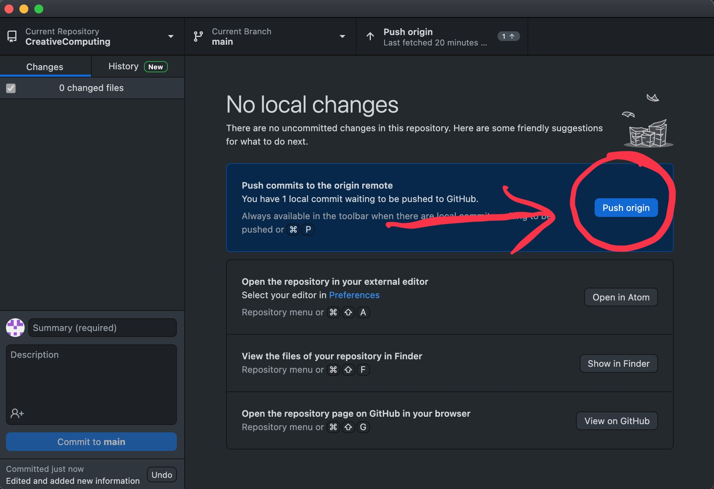

---
# Arduino
Next, I focused on experimenting with Arduino.

## Getting started

In the Monday workshop  we started to familiarise with Arduino. After putting every wire in wherever was possible, I watched some instructions online, and with some help from my classmates, I managed to get started with Arduino, what was very exiting.  With this very little knowledge of putting on a green led light, I went home and immerse myself in Arduino.

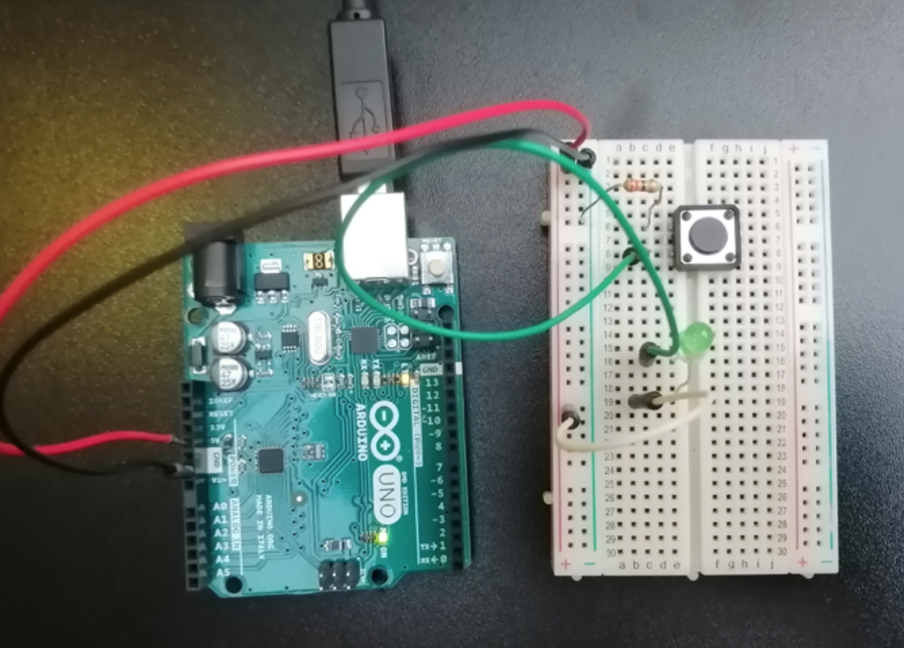
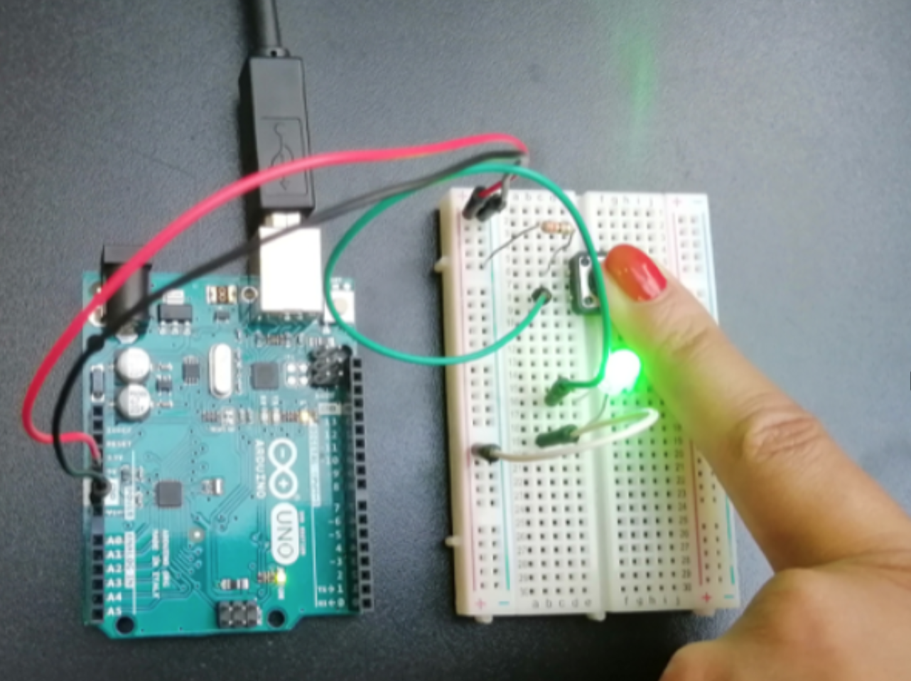
Figure 1: First experimentation with Arduino.


Arduino is a circuit board that have microcontroller chips on them.

**Microcontroller**:  The chip that connect your USB cable to the Arduino board, and communicate via USB.  This chip allow to send messages back and forward between your computer and your Arduino.
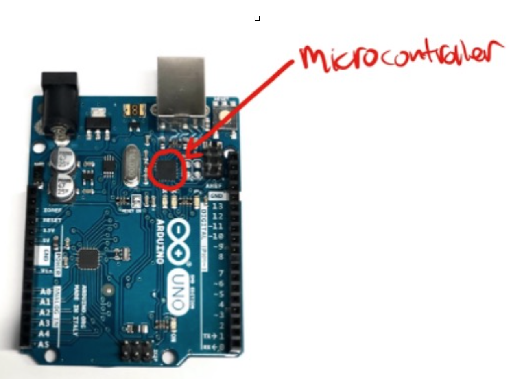

**Power pins**: you can connect wires here.


**TX and RX**:  for sending and receiving data. It's possible to use this port to send and receive data from a GPS module, Bluetooth modules, wifi modules etc.
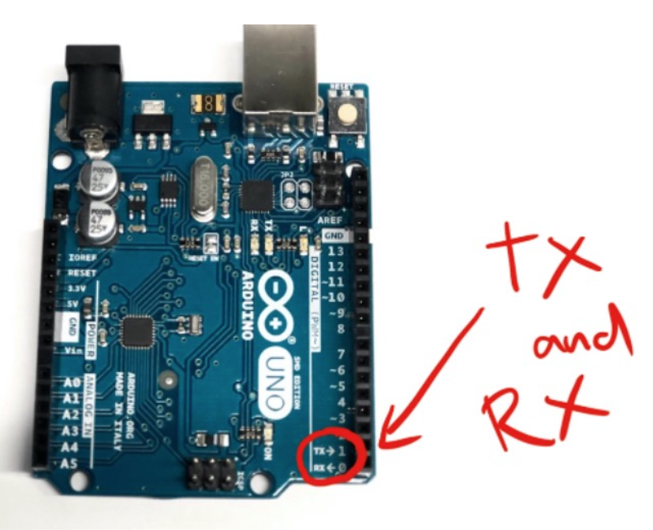

**Pin 2 to 13** are for digital inputs and outputs.
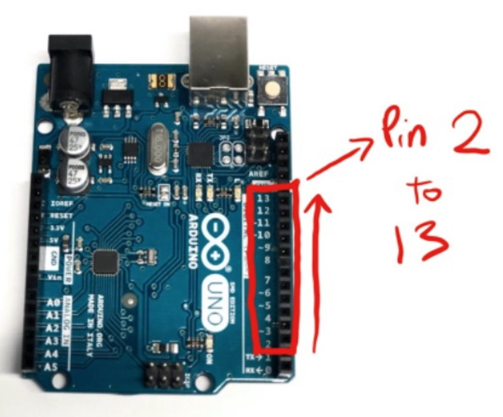

These are **6 analog input pins**. These are used to measure continuous voltages anywhere from 1 to 5v.
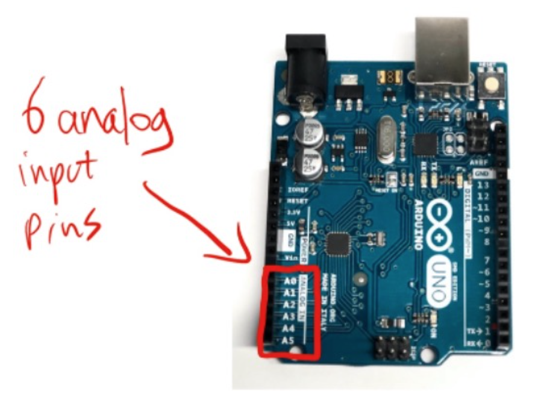

## Quote that inspired me
> “When you take technology and mix it with art, you always come up with something innovative”
<p style='text-align: right;'> Robert Rodriguez </p>

I  researched  how to use Arduino and after several youtube videos, I finally found one explains how to use Arduino in an easy way.  Thank too Paul McWhorter I started to code with Arduino, and  feel very exited about this new skill I’m learning.


**Notes from the youtube cannel of Paul McWhorter**: Arduino Tutorial 1: Setting Up and Programming the Arduino for Absolute Beginners.

**Bare minimum**: where you always start when you’re writing a program.

The command that you will put on -> `void setup`  will be executed one time.

The command on `void loop`, will we be executed over and over again.
Pin 13 is already hooked up to a little LED on the board.

First experiment with Arduino turning the lED light on pin 13 on and out and change speed.

Code:  

```
void setup() {
  // put your setup code here, to run once:
pinMode (13,OUTPUT);
}

void loop() {
  // put your main code here, to run repeatedly:
digitalWrite(13,HIGH);
delay(900);
digitalWrite(13,LOW);
delay(1000);
}

```

I have changed the code, putting on delay in the code so that  I can control the LED light on the board and decide the speed of the turning on and off.

Learned this, I wondered if I could reproduce the bouncing lights on the speed that I heard the first time I heard my daughter heart beat in my belly. I had recorded this in one of the midwives appointments, and kept it on my laptop.


## References
To be completed:

* https://www.youtube.com/watch?v=MmCGDJ90Qt4

* https://www.w3schools.com/html/html_images.asp

* https://www.tinkercad.com/things/jRqrrivMOat-editing-components/editel?lessonid=EFU6PEHIXGFUR1J&projectid=OIYJ88OJ3OPN3EA&collectionid=OIYJ88OJ3OPN3EA&tenant=circuits#/lesson-viewer

* https://www.markdownguide.org/basic-syntax/

* https://www.youtube.com/watch?v=e1FVSpkw6q4

* http://www.smoothware.com/danny/

* https://stackoverflow.com/questions/39014605/qooxdoo-image-centering/39015867#39015867

* https://www.instructables.com/Led-Cube-5x5x5-A-small-student-project/

* https://apple.stackexchange.com/questions/120624/which-application-to-preview-md-files

* https://stackoverflow.com/questions/14675913/changing-image-size-in-markdown

* https://stackoverflow.com/questions/35465557/how-to-apply-color-in-markdown

* https://stackoverflow.com/questions/12090472/how-do-i-center-an-image-in-the-readme-md-file-on-github

* https://stackoverflow.com/questions/6046263/how-to-indent-a-few-lines-in-markdown-markup

* https://product.hubspot.com/blog/git-and-github-tutorial-for-beginners

* https://medium.com/@aklson_DS/how-to-properly-setup-your-github-repository-windows-version-ea596b398b

* https://docs.github.com/en/get-started/quickstart/set-up-git


* https://www.youtube.com/watch?v=TI3yVcSahzk

* https://atom.io

* https://www.googleadservices.com/pagead/aclk?sa=L&ai=DChcSEwj0n6Wx6-zzAhWN3-0KHQ3oCTwYABACGgJkZw&ae=2&ohost=www.google.com&cid=CAESQOD26Iq-UxgBetr1hombwXMZo6Pr0f2UYWcQcF0cviCjd7ls5TFxL__AkyqTCbE06NKIIRu28-2OfXTnbM4X2Ps&sig=AOD64_2eHFRRHPjpESfnj0NAMoZe2zXwxQ&q&adurl&ved=2ahUKEwiksp2x6-zzAhXZQUEAHe8-D3UQ0Qx6BAgCEAE&dct=1


* https://qatalog.com/integrate/github/?utm_medium=paid-google&utm_source=search&utm_campaign=0221-partner-integrations&utm_content=github&gclid=Cj0KCQjwlOmLBhCHARIsAGiJg7l5zP_JMX8mBBonSty8sdMkJwNsyt55PCnEpkqbn8qxytr2-wM9230aAkx1EALw_wcB

* https://en.wikipedia.org/wiki/Computer_terminal

* https://forum.arduino.cc/?_gl=1\*9sevjx\*\_ga\*MTMwMDU3Mjk0OS4xNjM1MjAxMTc3\*\_ga_NEXN8H46L5\*MTYzNTQxNjkzNC4zLjAuMTYzNTQxNjkzNC4w


* https://www.youtube.com/watch?v=fJWR7dBuc18  (Fantastic!)


* https://www.youtube.com/watch?v=CfdaJ4z4u4w


* https://clideo.com/loop-video

* https://www.aconvert.com/audio/split/

* https://create.arduino.cc/projecthub/Code_and_Make/how-to-make-music-with-an-arduino-09ff1e

* https://stackoverflow.com/questions/6046263/how-to-indent-a-few-lines-in-markdown-markup

* https://daringfireball.net/projects/markdown/syntax
