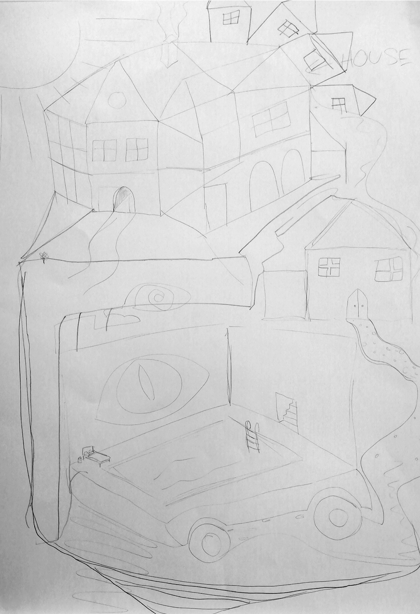

# **Embracing With Technology**.

Things from the past came back to my mind, especially when we played with Arduino during the workshop wit Jazmin Morris.

I remember my oldest brothers trying to create some little robots back in 2000. I was seven and they forbid me to even look at their stuff. My brothers were interested to understand every mechanism of some of my toys; for example, I had a little toy robot mouse that could walk. They dissembled it to see how it was made; needless to say, they couldn’t reassemble it and they broke it. Here I started to hate every thing that had to do with engineering. Nevertheless, in 2000 we had one computer at home and having internet was so special, for me it was mind-blowing that on Google I could find almost everything that came up in my mind.

I grow up in a very religious family and since we had the first computer at home, the word wide web was quite a taboo, in some way I stared not keeping updated with technology. On top of that I was (and still am) non so good in mathematics; numbers just make me want to draw/sketch on it. Nevertheless, everything about technology in some way intrigued me, but it looked so difficult and boring to understand, so for many years I left and ignored this curiosity.

Till I met my partner.

Creative computing is like a mix of me and him.

He is a Machine Learning Engineer, and everyday I hear talking about data, coding, maths and recommender systems. Every day, little by little, I started to understand a bit more about technology and softwares. He is the nerd, and I’m the creative one, together we are a perfect match that have created an amazing (and functional) piece of art: our daughter.

Thanks to this week and the introduction to creative computing of Jazmin Morris, I have no more excuses to feed this curiosity in technology and creative computing.  From my own experience I now that computing and creativity can create some amazing things.

In this readme file, there will be very basic information/notes/experiments with creative computing.

Notes

STEAM:  Science, Technology, Engineering, Arts for Mathematics.

GitHub: is a software that is typically used for version control. It is helpful when more than just one person is working on a project. Say for example, a software developer team wants to build a website and everyone has to update their codes simultaneously while working on the project.

HCI: Human Computer Interaction

OSS: Open-source software

Open source example: This is an example of open source we made in class on 25 Oct. The task was to design an house and each person in the class had only 60 second, they could copy/edit/delete what was already designed on the paper.

