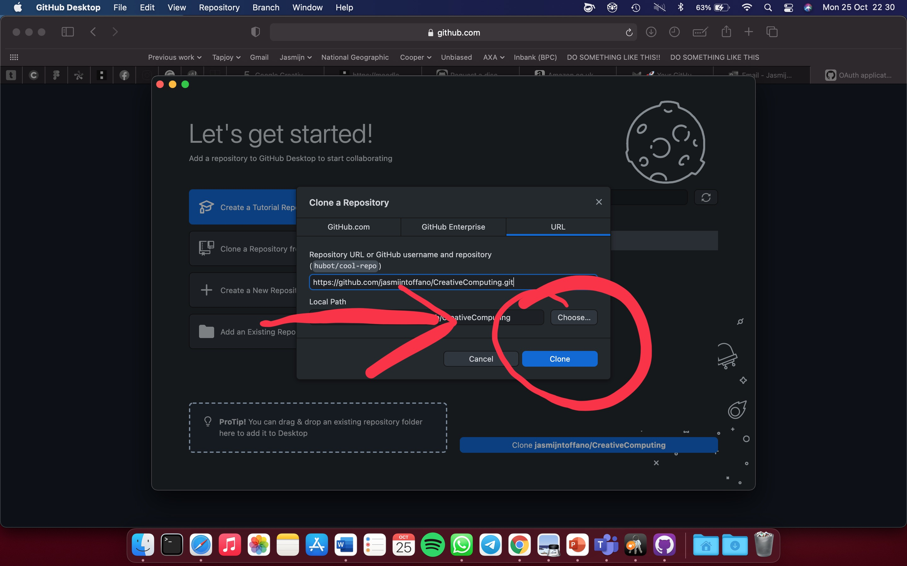

# **Embracing With Technology**

## Reflections

Things from the past came back to my mind, especially when we played with Arduino during the workshop wit Jazmin Morris.

I remember my oldest brothers trying to create some little robots back in 2000. I was seven and they forbid me to even look at their stuff. My brothers were interested to understand every mechanism of some of my toys; for example, I had a little toy robot mouse that could walk. They dissembled it to see how it was made; needless to say, they couldn’t reassemble it and they broke it. Here I started to hate every thing that had to do with engineering. Nevertheless, in 2000 we had one computer at home and having internet was so special, for me it was mind-blowing that on Google I could find almost everything that came up in my mind.

I grow up in a very religious family and since we had the first computer at home, the word wide web was quite a taboo, in some way I stared not keeping updated with technology ¯\\\_(ツ)_/¯.

On top of that I was (and still am) non so good in mathematics; numbers just make me want to draw/sketch on it. Nevertheless, everything about technology in some way intrigued me, but it looked so difficult and boring to understand, so for many years I left and ignored this curiosity.

**Till I met my partner ♡**

Creative computing is like a mix of me and him.

He is an Engineer, and everyday I hear talking about Maths and Physics. He is the nerd 🤓, and I’m the creative one 🤪, together we are a perfect match that have created an amazing (and functional) piece of art: <span style="color:pink">our daughter ♥︎</span>.

Thanks to this week and the introduction to creative computing of Jazmin Morris, I have no more excuses to feed this curiosity in technology and creative computing. From my own experience I now that computing and creativity can create some amazing things.

In this readme file, there will be very basic information/notes/experiments with creative computing.

#### 25/10/2021 Workshop Notes

Useful terminology:

* **STEAM**:  Science, Technology, Engineering, Arts for Mathematics.

* **HCI**: Human Computer Interaction

* **OSS**: Open-source software

  * *Open source example*: The image below is an example of open source we made in class with all students during the workshop. The task was to draw a house and each person had only 60 second to copy/edit/delete what was already designed on the paper.

<p align="center">

</p>


To style the above image I used StackOverflow ([link here](https://stackoverflow.com/questions/14675913/changing-image-size-in-markdown)) to research how to resize this image. They suggested to change the markdown syntax from

```

```
to
```

```

Then I wanted to center the image, so I followed [this other](https://stackoverflow.com/questions/12090472/how-do-i-center-an-image-in-the-readme-md-file-on-github) StackOverflow post where they simply recommended:

```
<p align="center">
  
</p>
```

* **GitHub**: Is one of the biggest open-source community. It's helpful when more than just one person is working on a project. For example, a software developer team wants to build a website and everyone has to update their codes simultaneously while working on the project.

GitHub discussion, is an dedicated space for the community to come together, ask and answer questions, and have open-ended conversations.

## Where my research led me

I decided to concentrate on the GitHub community. I wanted to create an account, upload my README.md file there and document everything. This will also be helpful for sharing my experience and learning with my classmates.

## Getting Started

* I went on [GitHub.com](https://github.com) and created an account
* I created a new repository
* GitHub automatically created a repository with a mock README.md file.
* Now that the repository exists on GitHub, I needed to clone it on my laptop. I clicked on the `Code` button, and chose _Open with GitHub Desktop_.


## Cloning a Repository

I chose _Open with GitHub Desktop_ because from my research I concluded that it was the easiest way. Then I followed the instructions to download the software and I logged in with my GitHub account:


Finally I clicked on **Clone the Repository**. I chose a path on my laptop where to download the repository.


_BE AWARE: I learnt the hard way that if I move the local folder or change the name of it, GitHub Desktop can't find the folder anymore._

## Edit README.md
After researching how to open a markdown file on mac ([link of forum post here](https://apple.stackexchange.com/questions/120624/which-application-to-preview-md-files)), I decided to install [Atom](https://atom.io) because it's a free and open-source text and source code editor developed by GitHub.

Atom has an option to toggle Markdown Preview, such that while I write I can view in real time how the final markdown would look like.


## Upload changes to GitHub

To upload my file, I would use GitHub Desktop, and there are two steps to it:
1. _Commit_: in this step I entered a small description of what the changes are.


2. _Push_: this is when the file on GitHub is uploaded.


## References
To be completed:

https://daringfireball.net/projects/markdown/syntax
